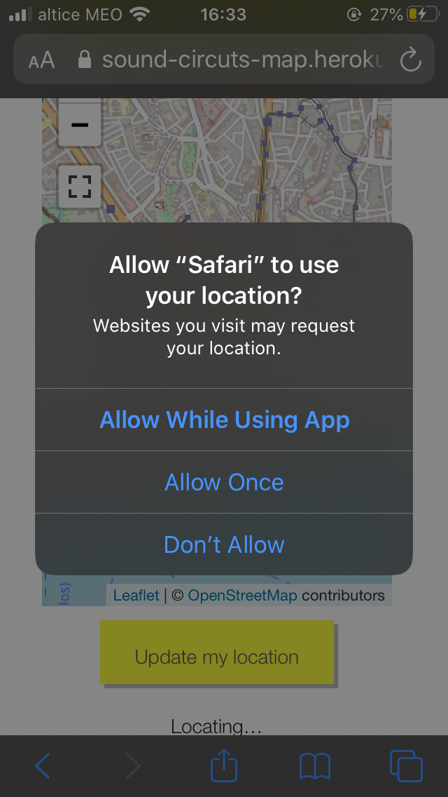

# Enable Location Services on Safari (iOS)

### Allow location access in Safari Settings

1. From the main Settings, scroll down to **Safari**

2. Go to **Location** and select **Allow** or **Ask**

   

### Enable Location Services

1. Go back to back to Settings, and select **Privacy**

2. Make sure **Location Services** are enabled

3. Go to **Safari** the applications list and allow location access

   

   

4. Refresh the browser window and try again, allow location when prompted

   

